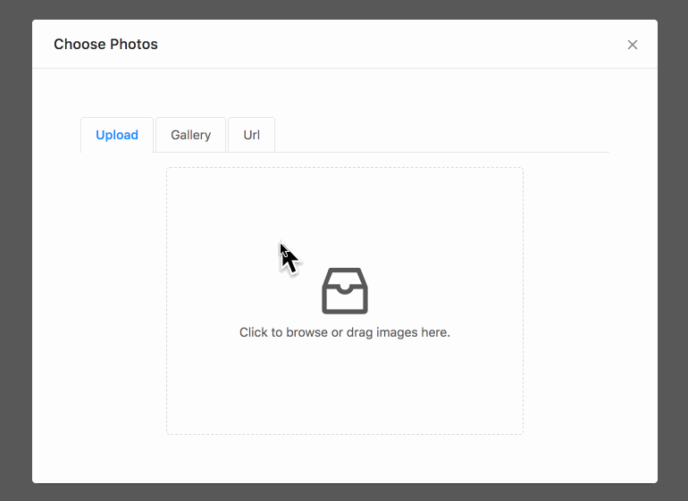

# image-upload [![NPM version][npm-image]][npm-url]  [![Dependency Status][daviddm-image]][daviddm-url]
> An image-uploader based on ant design (https://ant.design/)



## Installation

```sh
$ npm install --save @canner/image-upload
```

## Usage

```js
import React, {Component} from 'react';
import ReactDOM from 'react-dom';
import ImageUpload from '../src/index';

class Demo extends Component {
  constructor(props) {
    super(props);
    this.showPopup = this.showPopup.bind(this);
    this.closePopup = this.closePopup.bind(this);

    this.state = {
      popup: false
    };
  }

  showPopup() {
    this.setState({
      popup: true
    });
  }

  closePopup() {
    this.setState({
      popup: false
    });
  }

  onChange(value) {
    console.log(value)
  }

  render() {

    return (
      <div>
        <button onClick={this.showPopup}>show edit</button>
        <ImageUpload
          closeEditPopup={this.closePopup}
          editPopup={this.state.popup}
          onChange={this.onChange}
          multiple={true}
        />
      </div>
    );
  }
}

ReactDOM.render(
  <Demo/>
, document.getElementById('root'));

```

## Props

| Name         | Type    | Default | Description |
| ------------ | ------- | ------- | ----------- |
| locale | string | 'en' | Set locale |
| localeMessages | localeMessages: {[string]: string} | see `src/locale/en.js` | Locale messages |
| onChange | `(value: string \| Array<string>) => void` | null | called every change, if `multiple` to true `value` is an array. |
| closeEditPopup | `() => void` | null | called when close |
| editPopup | boolean | false | should popup show or not |
| multiple | boolean | false | allow upload multiple images or not. |
| galleryConfig | `Array<{name: string, gallery: Array<{ url: string, name: string }>}> \| null` | default `null` see `src/config.js` for demo settings | Setup albums for users to choose, in `Gallery` tab, disable if set to `null`. |
| serviceConfig | depends on services | undefined | pass image configurations generate from: https://github.com/Canner/image-service-config |

## Support i18n

This package support i18n, currently support languages:

- en (see [src/locale/en.js](./src/locale/en.js))
- zh_tw (see [src/locale/zh_tw.js](./src/locale/zh_tw.js))
- Submit your language! PRs are welcome!

**Usage:** import specific locale messages from `lib` folder, and pass it into `localeMessages` props.

```js
import zhTWLocale from '@canner/image-upload/lib/locale/zh_tw';

<ImageUpload
  locale="zh"
  localeMessages={zhTWLocale}
  {...otherProps}
/>
```


## Start example server

```
npm start
```

## License

Apache-2.0 © [Canner](https://www.canner.io)


[npm-image]: https://badge.fury.io/js/%40canner%2Fimage-upload.svg
[npm-url]: https://npmjs.org/package/@canner/image-upload
[travis-image]: https://travis-ci.org/Canner/image-upload.svg?branch=master
[travis-url]: https://travis-ci.org/Canner/image-upload
[daviddm-image]: https://david-dm.org/Canner/image-upload.svg?theme=shields.io
[daviddm-url]: https://david-dm.org/Canner/image-upload
